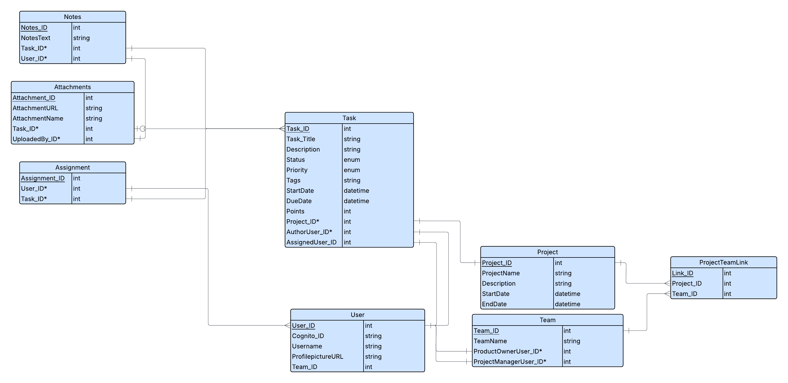

# Agile Task Manager

A project and task management board with Scrum-style views: a drag-and-drop kanban board, a table,
a list, and a Gantt timeline. Next.js on the front end, an Express and Prisma API over Postgres on
the back.

**Live:** https://agile-task-manager-client.vercel.app/

## What it does

- **Projects** — create projects and browse them from the home screen
- **Tasks** — create tasks with a status, priority, tags, dates, story points, an author and an
  assignee, and drag them between statuses on the board
- **Four views of a project** — a kanban board (`react-dnd`), a sortable table (MUI Data Grid), a
  list, and a Gantt timeline (`gantt-task-react`)
- **Priority pages** — tasks grouped by Urgent, High, Medium, Low and Backlog
- **Search** — fuzzy search across tasks, projects and users, powered by Fuse.js
- **Teams and users** — teams with their product owner and project manager, and the user directory
- **Dark mode** — toggled from the navbar and held in Redux

### Honest limits

- **There is no authentication.** The priority pages read a hardcoded `user_ID = 1` with the auth
  lookup commented out. Everyone sees the same data and nothing is private.
- **The demo may be serving fixtures.** The hosted database is not guaranteed to be running. When
  it cannot be reached, read endpoints fall back to the seed data in `server/prisma/seedData/` and
  flag the response with `"seeded": true` in its `meta`. Writes are never faked — they fail when
  the database is down.
- Attachments and comments exist in the schema and the seed data but have no UI.
- There are no tests.

## Stack

**Client** — Next.js 14 (App Router), React 18, TypeScript, Redux Toolkit with RTK Query and
redux-persist, Tailwind CSS, MUI Data Grid, `react-dnd`, `gantt-task-react`, Recharts.

**Server** — Express 5, Prisma 6 over Postgres, Fuse.js for search, helmet and morgan. Runs on
Vercel as a serverless function; `server/src/index.ts` serves the same app as an ordinary process
locally.



## Running it locally

You need Node 20+ and a Postgres database reachable through
[Prisma Accelerate](https://console.prisma.io) — the client is generated with `--data-proxy`, so
`DATABASE_URL` must use the `prisma://` protocol rather than `postgresql://`.

### Server

```bash
cd server
npm install
cp .env.example .env      # then set DATABASE_URL
npx prisma migrate deploy
npm run seed              # optional, loads the sample data
npm run dev               # http://localhost:8000
```

### Client

```bash
cd client
npm install
echo "NEXT_PUBLIC_API_URL=http://localhost:8000/api" > .env.local
npm run dev               # http://localhost:3000
```

Without `NEXT_PUBLIC_API_URL` the client talks to the deployed API, which is enough for front-end
work.

Other scripts: `npm run build` and `npm run lint` in `client/`; `npm run build` and
`npm run typecheck` in `server/`.

## API

Everything is served under `/api`.

| Method | Route | Purpose |
|---|---|---|
| `GET` | `/projects?limit=&offset=` | List projects, paginated |
| `POST` | `/projects` | Create a project |
| `DELETE` | `/projects/:project_ID` | Delete a project |
| `GET` | `/tasks?project_ID=&limit=&offset=` | Tasks for a project, paginated |
| `POST` | `/tasks` | Create a task |
| `PATCH` | `/tasks/:task_ID/status` | Update a task's status |
| `GET` | `/tasks/user/:user_ID` | Tasks authored by or assigned to a user |
| `GET` | `/search?query=` | Fuzzy search tasks, projects and users |
| `GET` | `/teams` | Teams with product owner and project manager names |
| `GET` | `/users` | All users |
| `POST` | `/users` | Create a user |
| `GET` | `/users/:cognitoId` | One user |

Read endpoints include `meta.seeded: true` when the response came from seed fixtures rather than
the database.

## License

MIT — see [LICENSE](LICENSE).
